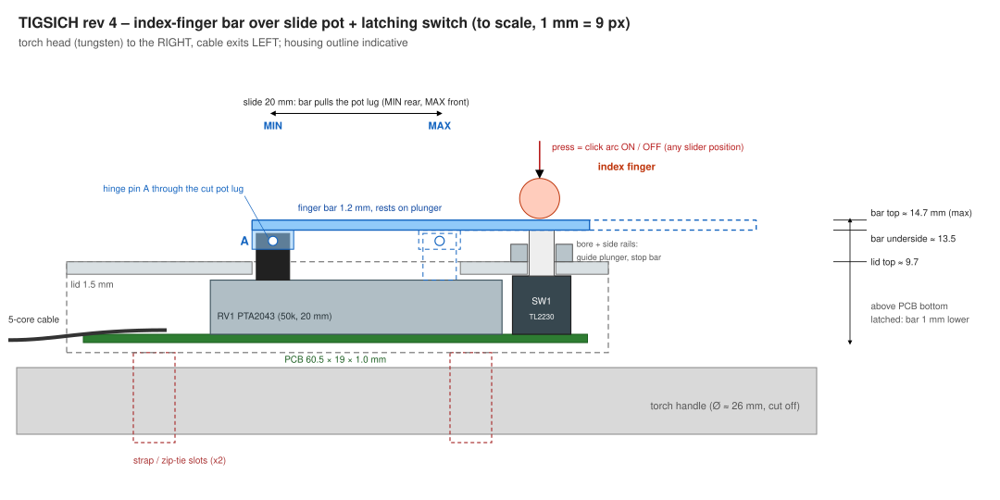
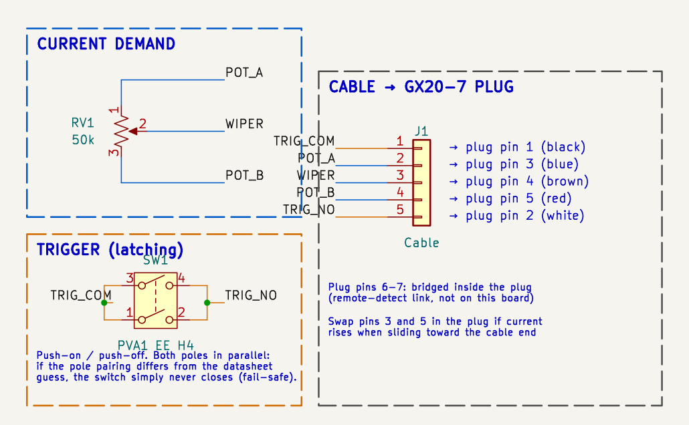
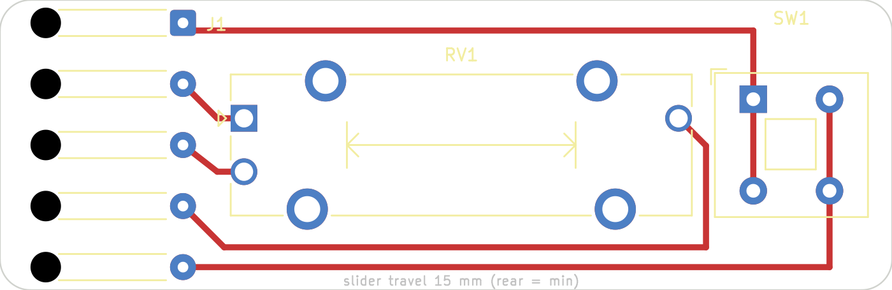
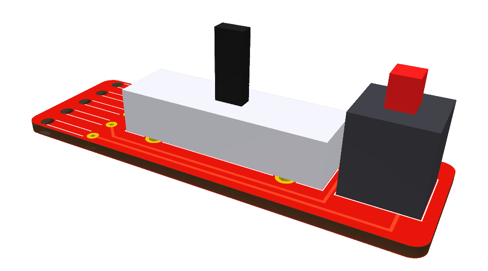

# TIGSICH – thumb-slider remote for IPOTools SuperTIG 200Di

A passive, torch-mounted current control that replaces the IPOTools **FT-47K-CL8** foot pedal.
A **thumb slider** sets the welding current and stays where you leave it. A **push-on / push-off button** starts and
stops the arc. The concept is the same as the [6061 Slide Lever](https://www.6061.com/slidelever.htm).

> **Status: design rev 2, not yet prototyped.** The socket voltages on the machine have **not been
> measured** yet. See [Open items](#open-items--before-first-use).

| Schematic | PCB (top) | 3D (approximate models) |
|---|---|---|
|  |  |  |

---

## 1. Machine interface

The machine has a GX20 7-pin remote socket. The pinout is the same one used by AHP/PrimeWeld pedals
(`configuration.jpeg`). It was confirmed by measuring the user's own FT-47K-CL8 pedal:

| Plug pin | Wire colour (diagram) | Function | Measured on FT-47K-CL8 |
|---|---|---|---|
| 1 | black | trigger contact | open → short when pedal pressed |
| 2 | white | trigger contact | 〃 |
| 3 | blue | pot end A | 3–4 and 4–5 swing 0.5 kΩ … 50 kΩ in opposite directions |
| 4 | brown | pot wiper | |
| 5 | red | pot end B | |
| 6–7 | – | remote-detect link | 0 Ω (bridged inside the plug) |

**Decisions based on this:**

- **Pot value 50 kΩ linear.** The pedal model name (47K) and the measurement (≈50 kΩ end to end) agree.
  The ±20 % pot tolerance doesn't matter, because the machine reads the wiper as a *ratio* of the reference voltage.
- **No series trim resistors.** The pedal's 0.5 kΩ minimum is simply the pot's residual resistance. The PTA datasheet
  specifies "500 Ω or 1 % max", which is exactly what the pedal shows.
- **Pins 6–7 are bridged inside the GX20 plug, not on the PCB.** This keeps the cable at 5 cores (thinner and more
  flexible on a torch).

### Supply voltage (assumed, not measured)

There is **no power pin** on this plug. The only voltages present are the pot reference (across 3–5) and the
trigger pull-up (across 1–2). Machines of this type typically put 5–15 V there, so the design
**assumes ≈12 V**. Because the design is passive, the voltage only has to stay within the parts' ratings:

| Part | Rating | Margin at 12 V |
|---|---|---|
| PTA1543 (15 mm, linear) | 100 V DC, 0.05 W | 12 V across 50 kΩ = 2.9 mW |
| PVA1 | 50 V DC, 100 mA, 3 W, sealed contacts for low-signal use | fine for a signal-level input |

---

## 2. Architecture

| Option | Outcome |
|---|---|
| Hall sensor + MCU + digital pot | **Rejected.** Needs power, and the plug has no supply pin. It would have to steal current from a 47 kΩ pot reference (≈0.2 mA) or use a battery. It also needs a high-voltage digital pot plus HF-start hardening. |
| Finger lever (bell-crank) driving a slide pot, trigger from lever travel (rev 1) | **Rejected on size.** A 35° lever swing needs a 25 mm drive arm to move the slider 15 mm, which put the pivot 41 mm above the PCB and the lever top about 50 mm up. The board was also 22.5 mm wide. |
| **Thumb slider + separate latching button (rev 2, chosen)** | Passive, no linkage, about 20 mm tall, 19 mm wide. The pot is still electrically identical to the pedal. |

**How it's used:**

1. **Set the current:** slide the knob. Rear = minimum, front = maximum. It stays where you leave it, because the pot's
   own 30–250 gf friction holds it.
2. **Start the arc:** press the button once. It latches and closes pins 1–2.
3. **Stop the arc:** press it again.

The machine stays in **2T mode**, as it would with the pedal.
This is how the 6061 Slide Lever works. The trade-off is that nothing stops the arc if you drop the torch: that
takes a deliberate press. A momentary button (hold to weld) would fit the same footprint (`PVA1 OA H4`) if that
behaviour is preferred.

---

## 3. Parts

| Ref | Part | Why |
|---|---|---|
| RV1 | **Bourns PTA1543-2015CIB503**: 15 mm travel, 50 kΩ linear, single gang, PC pins, **no centre detent**, 15 mm insulated (CI) lever | Short slider (30 mm body), so the unit stays short. 15 mm travel ≈ 13 A/mm on a 200 A machine, which was the user's choice over 20 or 30 mm. **Not** `-2215…`: that code has a *centre detent*. The 15 mm lever (not 10 mm) is needed so the lever reaches through the lid (see heights). |
| SW1 | **C&K PVA1 EE H4 1.2N V2**: DPST, push-push (latching), 15 mm total height, sealed/dust-proof contacts | The contacts are sealed and dust-proof, which matters near grinding and welding dust. It's rated for low-signal loads and 100,000 operations, has a short 1.5 mm latching stroke and 1.2 N force, and is in stock (DigiKey/Mouser). It has a standard KiCad footprint. H4 (15 mm) is the lowest PVA1 height. |
| J1 | Solder pads with strain-relief holes (`SolderWire-0.15sqmm_1x05_P4mm…_Relief`) | No connector to shake loose on a torch. The wire passes up through a 2 mm hole before reaching its pad, so it's held in place. |
| Cable | 5 × 0.14 mm² flexible (insulation OD ≤ 1.5 mm), ~4 m, GX20-7 female plug | Same length as the original pedal (4.3 m). |

**Both switch poles are wired in parallel, in a fail-safe way.** The PVA datasheet doesn't label which PVA1 pins
form each pole. By analogy with the PVA2 drawing, the poles are pads 1–2 and 3–4. The board ties
**pads 1+3 → TRIG_COM** and **pads 2+4 → TRIG_NO**:

- **If the guess is right** (1–2 / 3–4), or the poles are diagonal (1–4 / 2–3), both poles end up in parallel. That gives
  redundant contacts for a low-level signal.
- **If the poles are really 1–3 / 2–4**, each pole just joins COM to COM and NO to NO, so the switch **never closes**.
  It can never be stuck *on*. Check with a meter before first use.

**Pot life:** the PTA is rated at **15,000 slide cycles**. With a set-and-leave slider (rather than a pedal that moves
on every weld) that goes much further than in rev 1. A conductive-plastic slide pot of the same footprint is the
upgrade path.

**No filtering or ESD parts on the board.** The original pedal is a bare pot and switch, and the machine's input
circuitry was designed for that. If HF-start interference shows up, the first fix is a shielded cable with the shield
grounded at the machine end.

---

## 4. Mechanics and heights (see `docs/mechanism.svg`)

All heights are measured from the PCB bottom, using nominal datasheet values:

| Item | Height |
|---|---|
| PCB | 1.6 mm |
| Pot body top | 8.1 mm |
| PVA1 body top | 12.5 mm |
| Lid (2 mm), resting just above the PVA1 body | 12.9 → **14.9 mm** |
| PTA lever top (15 mm lever) | 18.1 mm (3.2 mm through the lid; the knob clamps on here) |
| PVA1 plunger top | 16.6 mm (plus a printed cap ≈ 18.9 mm) |
| **Knob top** | **≈ 19.9 mm** |

Rev 1 reached about 50 mm, so this is about **30 mm lower**.

Housing notes:

- **Lid slot:** the slot for the pot lever is 15 mm of travel plus the 4 mm lever, so about 19.5 × 1.5 mm.
  The **knob has a skirt** wider than the slot, so it covers the slot at every position and keeps dust out of the pot.
- **Lid fixing:** the lid screws into the pot's two **M2 threaded holes** (on top of the pot frame, 26 mm apart).
  This clamps lid, pot and PCB into one stack. The PCB has **no mounting holes**, because there's no room at 19 mm wide.
  The PCB rests in grooves or on ribs in the housing floor, which also carry the button-press force.
- **Mounting on the torch:** two strap or zip-tie slots in the housing floor. The cable exits at the rear, alongside the torch hose.

---

## 5. PCB

- **Board:** **58.5 × 19 mm**, 2 layers, 1.6 mm, rounded corners (R2), 0.4 mm tracks (signal-level currents).
  All copper is on the top layer, with no vias. There is no ground plane: the circuit has no ground.
- **Width:** the 19 mm is set by the 5-pad cable column (16 mm of pads at 4 mm pitch, plus pad size and edge clearance).
  The pot is only 11 mm wide including its tabs. A 3.7 mm pitch pad set would bring the board to about 18 mm, but only
  with cable insulation of 1 mm OD or less.
- **Layout, rear to front (cable → torch head):**
  1. **Cable pads (J1):** at the rear edge.
  2. **Slide pot (RV1):** its slider runs along the board centreline.
  3. **Latching button (SW1):** at the front, centred.
- **Routing:** the pot and switch connections that pass alongside the pot run in lanes above and below the pot body.
- **Pot direction:** RV1 pin 1 (the rear end) connects to plug pin 3, so the **rear slider position = wiper next to
  plug pin 3**, i.e. P3–P4 ≈ 0.5 kΩ. If the machine gives *maximum* current at the rear, swap the wires on plug pins 3 and 5.
- **J1 pad order** (top to bottom) is chosen so nothing crosses. It's printed on the **bottom** silkscreen next to each pad:

| J1 pad | Silk | Net | Plug pin | Diagram colour |
|---|---|---|---|---|
| 1 | P1 | TRIG_COM | 1 | black |
| 2 | P3 | POT_A | 3 | blue |
| 3 | P4 | WIPER | 4 | brown |
| 4 | P5 | POT_B | 5 | red |
| 5 | P2 | TRIG_NO | 2 | white |

- **Footprints:** all come from the standard KiCad library, so the project has no custom footprint library.
- **3D models:** `tigsich.3dshapes/*.wrl` are **rough block models** for fit checks only. KiCad has no PTA1543 or
  PVA1 model. Download the vendor STEP files before designing the housing.

**Verification:**

- **ERC:** 0 violations.
- **DRC:** 0 violations, 0 unconnected, 0 schematic-parity issues.
- **Tool:** KiCad 10.0.6.

---

## 6. Files

| Path | Content |
|---|---|
| `tigsich.kicad_pro/.kicad_sch/.kicad_pcb` | KiCad project |
| `tigsich.3dshapes/` | Approximate 3D models |
| `docs/mechanism.svg` | Scaled side view with heights |
| `docs/schematic.pdf` / `.png` | Schematic exports |
| `docs/pcb_layout.png`, `docs/pcb_3d.png` | Board renders |
| `configuration.jpeg` | 7-pin plug pinout reference |

---

## Open items / before first use

1. **Measure the socket.** With the machine on and the pedal unplugged, measure the DC voltage across 3–5, across 1–2, and from
   each pin to the case. It must be ≤ 50 V on 1–2 for the PVA1. Don't strike an arc (HF start) while probing.
2. **Check the switch.** Before soldering, check with a meter that pins 1–2 and 3–4 of the PVA1 close when it's latched.
   On the finished board, check that P1–P2 is open when the button is released and closed when it's latched.
3. **Check the pot direction:** the rear slider position should give minimum current. Swap plug pins 3/5 if needed.
4. **Check part dimensions** against real parts: PTA lever height and PVA1 body height set the lid height.
5. **Design the housing:** lid with slot and M2 screws into the pot, knob with skirt, button cap, PCB grooves,
   strap slots, cable gland.
6. **Test first on scrap:** check minimum and maximum current, that the latch works with gloves on, and that HF start
   doesn't cause flicker. If it does, use a shielded cable.

## Sources

- [SSC C910-0725 info sheet (same 7-pin pinout)](https://ssccontrols.com/uploads/Product-Information-Sheet-C910-0725-TIG-Foot-Controls.pdf)
- [IPOTools FT-47K-CL8 foot pedal](https://ipotools.eu/product/tig-foot-pedal/)
- [Bourns PTA series datasheet](https://www.bourns.com/docs/product-datasheets/pta.pdf)
- [C&K PVA series datasheet](https://www.mouser.com/datasheet/2/240/pva-3050984.pdf)
- [PVA1 EE H4 1.2N V2 on DigiKey](https://www.digikey.com/en/products/detail/c-k/PVA1-EE-H4-1-2N-V2/417716)
- [6061 Slide Lever (concept reference)](https://www.6061.com/slidelever.htm)
